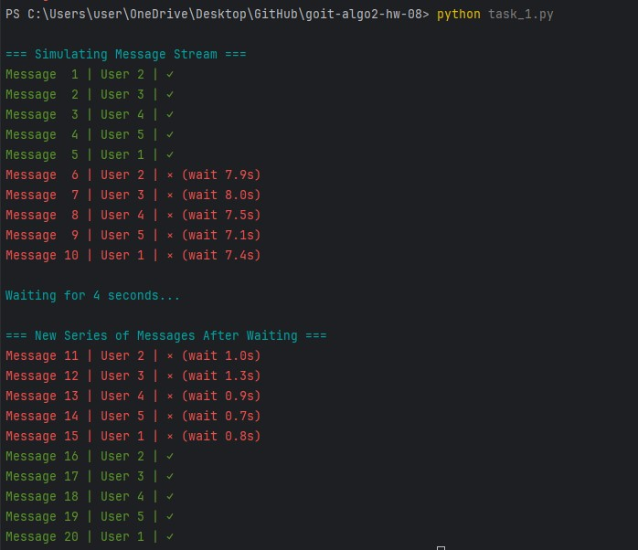
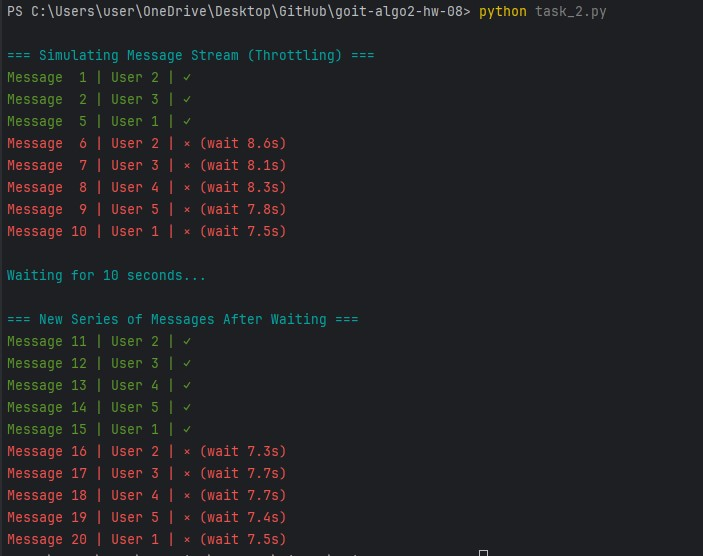

# goit-algo2-hw-08
# HW-8 | Flow Control Algorithms and Rate Limiting

## Welcome 🌞

Today, you will practice applying data flow control algorithms to solve 
practical problems.

Imagine that a chat system needs to implement a mechanism to limit the rate of 
user messages to prevent spam. You need to achieve this in two ways:

1. **Using the Sliding Window algorithm** for precise time interval control, 
allowing tracking of the number of messages within a given time window and 
restricting users from sending messages if the limit is exceeded.
2. **Using the Throttling algorithm** to control time intervals between 
messages, ensuring a fixed waiting interval between user messages and limiting 
the sending frequency if the interval is not maintained.

Ready? Let's get to work!

Good luck! 😎

---

## Task 1. Implementing a Rate Limiter using the Sliding Window algorithm to limit message frequency in a chat

A chat system requires a message rate-limiting mechanism to prevent spam. 
The implementation should use the Sliding Window algorithm to precisely control
time intervals, allowing tracking of message counts within a given time window 
and restricting users from sending messages if the limit is exceeded.

### Technical Requirements

1. The implementation must use the **Sliding Window algorithm** for accurate 
time interval control.
2. Basic system parameters:
   - `window_size` — 10 seconds
   - `max_requests` — 1 message per window
3. Implement the class **SlidingWindowRateLimiter**.
4. Implement the following class methods:
   - `_cleanup_window` — to remove outdated requests from the window and update the active time window.
   - `can_send_message` — to check if a message can be sent in the current time window.
   - `record_message` — to record a new message and update the user’s message history.
   - `time_until_next_allowed` — to calculate the waiting time before the next allowed message.
5. Use `collections.deque` to store message history.

### Acceptance Criteria

📌 These criteria are mandatory for mentor evaluation. If any criterion is not 
met, the mentor will return the homework for revision without grading. If you 
need clarification or are stuck, contact your mentor on Slack.

1. If a user attempts to send a message before 10 seconds have passed, the `can_send_message` method must return `False`.
2. The first message from a user should always return `True`.
3. If all messages are removed from a user's window, their record should be removed from the data structure.
4. The `time_until_next_allowed` method should return the wait time in seconds.
5. The test function should run according to the provided example and work as expected.

### Task Template

```python
import random
from typing import Dict
import time
from collections import deque

class SlidingWindowRateLimiter:
    def __init__(self, window_size: int = 10, max_requests: int = 1):
        pass
    
    def _cleanup_window(self, user_id: str, current_time: float) -> None:
        pass

    def can_send_message(self, user_id: str) -> bool:
        pass

    def record_message(self, user_id: str) -> bool:
        pass

    def time_until_next_allowed(self, user_id: str) -> float:
        pass

# Test function

def test_rate_limiter():
    limiter = SlidingWindowRateLimiter(window_size=10, max_requests=1)
    
    print("\n=== Simulating message stream ===")
    for message_id in range(1, 11):
        user_id = message_id % 5 + 1
        result = limiter.record_message(str(user_id))
        wait_time = limiter.time_until_next_allowed(str(user_id))
        print(f"Message {message_id:2d} | User {user_id} | {'✓' if result else f'× (wait {wait_time:.1f}s)'}")
        time.sleep(random.uniform(0.1, 1.0))
    
    print("\nWaiting 4 seconds...")
    time.sleep(4)
    
    print("\n=== New series of messages after waiting ===")
    for message_id in range(11, 21):
        user_id = message_id % 5 + 1
        result = limiter.record_message(str(user_id))
        wait_time = limiter.time_until_next_allowed(str(user_id))
        print(f"Message {message_id:2d} | User {user_id} | {'✓' if result else f'× (wait {wait_time:.1f}s)'}")
        time.sleep(random.uniform(0.1, 1.0))

if __name__ == "__main__":
    test_rate_limiter()
```

---

## Task 2. Implementing a Rate Limiter using the Throttling algorithm to limit message frequency in a chat

A chat system requires a message rate-limiting mechanism to prevent spam. 
The implementation should use the Throttling algorithm to control time 
intervals between messages, ensuring a fixed waiting interval between user 
messages and limiting the sending frequency if the interval is not maintained.

### Technical Requirements

1. The implementation must use the **Throttling algorithm** for controlling time intervals.
2. Basic system parameter:
   - `min_interval` — 10 seconds (minimum interval between messages)
3. Implement the class **ThrottlingRateLimiter**.
4. Implement the following class methods:
   - `can_send_message` — to check if a message can be sent based on the time of the last message.
   - `record_message` — to record a new message and update the time of the last message.
   - `time_until_next_allowed` — to calculate the waiting time before the next allowed message.
5. Use `Dict[str, float]` to store the time of the last message.

### Acceptance Criteria

1. If a user attempts to send a message before 10 seconds have passed since their 
last message, the `can_send_message` method must return `False`.
2. The first message from a user should always return `True`.
3. The `time_until_next_allowed` method should return the wait time in seconds 
before the next allowed message.
4. The test function should run according to the provided example and work as expected.

### Task Template

```python
import time
from typing import Dict
import random

class ThrottlingRateLimiter:
    def __init__(self, min_interval: float = 10.0):
        pass

    def can_send_message(self, user_id: str) -> bool:
        pass

    def record_message(self, user_id: str) -> bool:
        pass

    def time_until_next_allowed(self, user_id: str) -> float:
        pass

def test_throttling_limiter():
    limiter = ThrottlingRateLimiter(min_interval=10.0)
    
    print("\n=== Simulating message stream (Throttling) ===")
    for message_id in range(1, 11):
        user_id = message_id % 5 + 1
        result = limiter.record_message(str(user_id))
        wait_time = limiter.time_until_next_allowed(str(user_id))
        print(f"Message {message_id:2d} | User {user_id} | {'✓' if result else f'× (wait {wait_time:.1f}s)'}")
        time.sleep(random.uniform(0.1, 1.0))
    
    print("\nWaiting 10 seconds...")
    time.sleep(10)
    
    print("\n=== New series of messages after waiting ===")
    for message_id in range(11, 21):
        user_id = message_id % 5 + 1
        result = limiter.record_message(str(user_id))
        wait_time = limiter.time_until_next_allowed(str(user_id))
        print(f"Message {message_id:2d} | User {user_id} | {'✓' if result else f'× (wait {wait_time:.1f}s)'}")
        time.sleep(random.uniform(0.1, 1.0))

if __name__ == "__main__":
    test_throttling_limiter()
```

---

# TASKS' RESULTS

### Task 1


### Task 2

